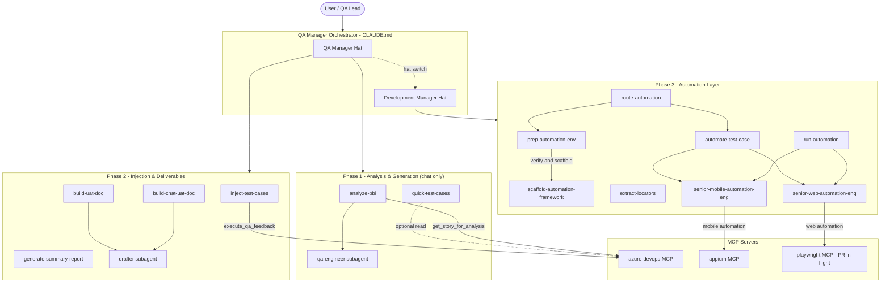

# QA-Final-V4 — Azure DevOps QA Automation MCP Server

An end-to-end **QA orchestration system** powered by an MCP (Model Context Protocol)
server that bridges Azure DevOps with Claude / Claude Code. The system acts as a
single intelligent QA Manager that handles the full lifecycle: deriving test cases
from PBIs, reviewing coverage, injecting cases into Azure DevOps, generating client
UAT documents, and — at the end of the loop — preparing and running automated tests
through Playwright (web) and Appium (mobile) MCP servers.

> Built for the WOQOD QA team. Project/business specifics live in
> `.claude/context/` — swap those files to retarget the engine to a different project.

---

## Why this exists

QA work on a sprint typically fragments across many tools: someone reads the PBI in
Azure, someone derives test cases in Word/Excel, someone pastes them into Azure
manually, someone writes the UAT doc by hand, someone else writes automated tests
later. Mistakes leak between the stages: missed edge cases, mismatched tags,
hand-rolled UAT formatting, stale automation. This repo collapses the whole pipeline
into a single conversation: you point the QA Manager at a PBI ID and it carries the
work through analysis → review → injection → UAT doc → automation, with explicit
hand-offs and sign-offs at each phase.

---

## High-level architecture



---

## The three phases

| Phase | Goal | Skills involved | Writes to |
|---|---|---|---|
| **1. Analysis & Generation** | Derive complete test coverage from a PBI in chat | `analyze-pbi`, `quick-test-cases` | Chat only (no Azure, no files) |
| **2. Injection & Deliverables** | Push approved cases to Azure; produce client UAT doc | `inject-test-cases`, `build-uat-doc`, `build-chat-uat-doc`, `generate-summary-report` | Azure DevOps + `.docx` |
| **3. Automation Layer** | Stand up runnable tests for the chosen surface | `prep-automation-env`, `route-automation`, `scaffold-automation-framework`, `extract-locators`, `automate-test-case`, `run-automation` | `./automation/` (project root, git-ignored here) |

Each phase has a hard sign-off gate — Phase 1 never injects, Phase 2 never invents
cases, Phase 3 never re-judges coverage. The QA Manager owns the gates.

---

## The hat-switch: QA Manager → Development Manager

The same orchestrator wears two hats:

- **QA Manager** (Phase 1 + 2): defines scope, runs the coverage review, signs off,
  pushes to Azure, produces the UAT.
- **Development Manager** (Phase 3): detects the project surface from Platform tags,
  picks the automation path (Playwright for web, Appium for mobile), prepares the
  environment, and delegates the implementation to the senior automation engineers.

The hat-switch is explicit: it happens at the end of Phase 1 (surface is recorded in
the sign-off) and again at the Phase 2 → 3 boundary (`route-automation` confirms and
hands off).

---

## Skills router

> Procedures live in skills — the QA Manager does not improvise them inline.

| Skill | Phase | What it does |
|---|---|---|
| `analyze-pbi` | 1 | Full Phase-1 coverage for a PBI — all 8 framework categories, 4-step edge methodology, sign-off with detected surface |
| `quick-test-cases` | 1 | Tight prioritized subset (happy + critical negatives + sharpest edges) |
| `inject-test-cases` | 2 | Phase-2 transport — pushes the approved set into Azure DevOps under a parent PBI |
| `build-uat-doc` | 2 | Client UAT `.docx` built from the Azure suite filtered by `Tag = UAT` |
| `build-chat-uat-doc` | 2 | Client UAT `.docx` built directly from the approved chat set (no Azure read needed) |
| `generate-summary-report` | 2 | HTML quality summary of the injected batch |
| `prep-automation-env` | 3 | Verifies MCP + host + framework readiness for the chosen surface, scaffolds if missing |
| `route-automation` | 3 | Phase 2.5 hybrid trigger — reads Azure, asks before starting Phase 3, skips iOS on non-macOS with actionable warning |
| `scaffold-automation-framework` | 3 | Generates `./automation/` (web / mobile / both) with the canonical structure |
| `extract-locators` | 3 | Pulls real locators on demand from the live app into the Page/Screen Object |
| `automate-test-case` | 3 | Translates one approved QA case into a runnable pytest test |
| `run-automation` | 3 | Executes the pytest suite, produces an Allure report |

---

## Sub-agents

| Agent | Type | Role |
|---|---|---|
| `qa-engineer` | Reasoning (no MCP, no code) | Derives exhaustive test cases from a PBI spec; applies the full framework, the 4-step edge methodology, and the template format |
| `drafter` | Reasoning + file I/O | Turns approved sets into `.docx` deliverables (client UAT, end-user feature manual). Never re-judges coverage |
| `senior-web-automation-eng` | Coding (Read/Write/Edit/Bash) | Builds and runs the Playwright + pytest web framework |
| `senior-mobile-automation-eng` | Coding (Read/Write/Edit/Bash) | Builds and runs the Appium + pytest mobile framework; uses the Appium MCP for locator extraction |

---

## MCP servers (registered in `.mcp.json`)

| Server | Purpose | Status |
|---|---|---|
| `azure-devops` | Read PBIs, inject test cases, query coverage / outcomes | ✅ Active |
| `appium` | Mobile UI inspection + locator extraction (`appium-mcp@latest` via npx) | ✅ Active |
| `playwright` | Web automation inspection (registration PR in flight) | 🟡 Provisional |

---

## Context files (the engine's knowledge)

| File | Owns |
|---|---|
| `.claude/context/woqod-background.md` | Project / business facts: services, surfaces, roles |
| `.claude/context/woqod-standards.md` | QA standards: IDs, priorities, tag taxonomy (Lifecycle / Service / Platform / Category) |
| `.claude/context/analysis-framework.md` | The 8 test categories + the 4-step edge methodology |
| `.claude/context/test-case-template.md` | Field-level test case format + Azure mapping |
| `.claude/context/automation-standards.md` | Automation framework contract: structure, locator strategy, wrapper rules, Allure |

---

## Setup

### Prerequisites

- Python 3.11+ (3.14 in the working `.venv`)
- Node.js 18+ (22.x recommended) — required for the `appium` MCP via `npx`
- Appium 2+ with the `uiautomator2` driver installed (for Android automation)
- Android SDK + ADB on PATH (for Android device automation)
- **macOS host** with Xcode + `xcuitest` driver (for iOS automation only — not Windows-compatible)
- Azure DevOps PAT with read + work-item write permissions

### Install

```powershell
git clone <repo-url>
cd azure-mcp
python -m venv .venv
.venv\Scripts\python.exe -m pip install -r requirements.txt
```

### Configure

Create a `.env` file in the repo root (never commit it):

```
AZURE_PAT=<your personal access token>
AZURE_ORG_URL=https://dev.azure.com/<your-org>
AZURE_PROJECT=<your project name>
```

### Run

Cursor / Claude Code reads `.mcp.json` automatically. Open the repo in an
MCP-aware client and start a conversation:

> Analyze PBI 123456

The QA Manager will pick up `analyze-pbi` and run the full Phase-1 flow.

---

## Repository layout

```
azure-mcp/
├─ server.py                      # MCP entry point (FastMCP)
├─ core/                          # MCP business logic
│  ├─ analysis.py
│  ├─ discovery.py
│  ├─ engines.py
│  ├─ output_manager.py
│  ├─ reporting.py
│  ├─ test_planner.py
│  └─ utils.py
├─ requirements.txt
├─ .mcp.json                      # MCP server registry (azure-devops + appium)
├─ CLAUDE.md                      # QA Manager prompt / orchestration rules
└─ .claude/
   ├─ agents/                     # Sub-agent definitions (qa-engineer, drafter, etc.)
   ├─ commands/                   # Slash commands (qa-mode, dev-mode)
   ├─ context/                    # Engine knowledge (5 files)
   ├─ skills/                     # 11 skills, one folder each with SKILL.md
   └─ settings.json
```

The generated automation framework (`./automation/`) lives at the project root and
is **git-ignored** — it is not committed to this repo.

---

## Recent updates

- `prep-automation-env` skill added — explicit surface readiness gate before automation
- Surface detection step added to Phase 1 (`analyze-pbi`, `quick-test-cases`)
- Appium MCP registered alongside Azure DevOps MCP
- Marker taxonomy aligned with `automation-standards.md` — `smoke`/`sanity`/`mobile`/`automated` markers removed; only `regression` + Platform markers (`web`/`ios`/`android`/`control_panel`) remain
- Null-byte file corruption repaired in `senior-mobile-automation-eng.md` and `run-automation/SKILL.md`
- `requirements.txt` now includes `python-docx==1.2.0`
- Cleanup: project-specific scratch scripts moved out of root; Word temp/lock files added to `.gitignore`

---

## License

Internal — WOQOD QA team.
