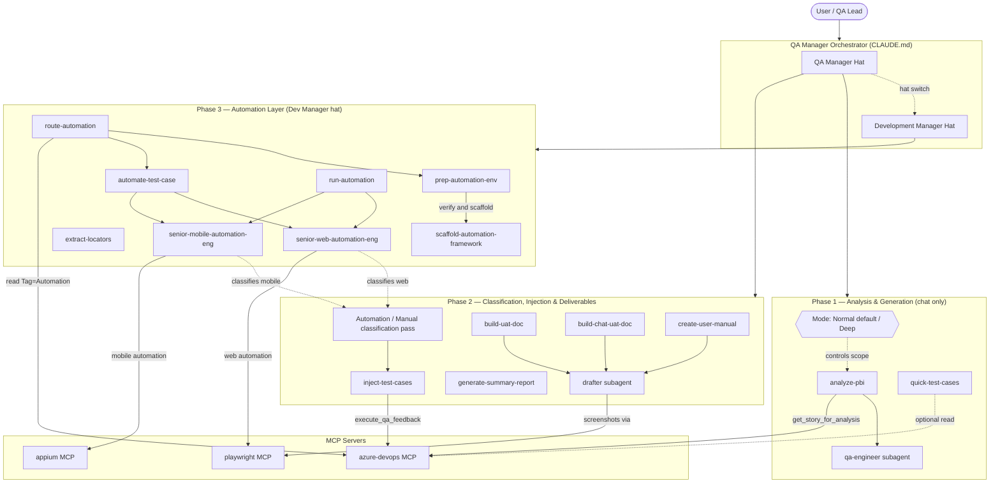

# QA-Final-V4 — Azure DevOps QA Automation MCP Server

An end-to-end **QA orchestration system** powered by an MCP (Model Context Protocol)
server that bridges Azure DevOps with Claude / Claude Code. The system acts as a
single intelligent QA Manager that handles the full lifecycle: deriving test cases
from PBIs in two analysis modes (Normal default / Deep), classifying them for
automation, injecting cases into Azure DevOps, generating client UAT documents and
end-user feature manuals, and — at the end of the loop — preparing and running
automated tests through Playwright (web) and Appium (mobile) MCP servers.

> Built for the WOQOD QA team. Project/business specifics live in
> `.claude/context/` — swap those files to retarget the engine to a different project.

---

## Why this exists

QA work on a sprint typically fragments across many tools: someone reads the PBI in
Azure, someone derives test cases in Word/Excel, someone pastes them into Azure
manually, someone writes the UAT doc by hand, someone else writes automated tests
later. Mistakes leak between the stages: missed edge cases, mismatched tags,
hand-rolled UAT formatting, stale automation. This repo collapses the whole pipeline
into a single conversation: you point the QA Manager at a PBI ID and it carries the
work through analysis → review → classification → injection → UAT doc / user manual
→ automation, with explicit hand-offs and sign-offs at each phase.

---

## High-level architecture



---

## The three phases

| Phase | Goal | Skills involved | Writes to |
|---|---|---|---|
| **1. Analysis & Generation** | Derive test coverage from a PBI in chat, in the chosen **mode** (Normal default / Deep) | `analyze-pbi`, `quick-test-cases` | Chat only (no Azure, no files) |
| **2. Classification, Injection & Deliverables** | Tag every case `Automation` / `Manual` (pre-injection), push to Azure, produce client UAT doc and end-user manual | `inject-test-cases`, `build-uat-doc`, `build-chat-uat-doc`, `create-user-manual`, `generate-summary-report` | Azure DevOps + `.docx` |
| **3. Automation Layer** | Stand up runnable tests for the chosen surface | `prep-automation-env`, `route-automation`, `scaffold-automation-framework`, `extract-locators`, `automate-test-case`, `run-automation` | `./automation/` (project root, git-ignored here) |

Each phase has a hard sign-off gate — Phase 1 never injects, Phase 2 never invents
cases, Phase 3 never re-judges coverage. The QA Manager owns the gates.

---

## Analysis modes — Normal (default) vs Deep

Every analysis runs in one of two modes. The user names the mode when submitting the
PBI; **if unspecified, the default is Normal.**

| Category | Normal (default) | Deep |
|---|---|---|
| UI / Functional-High / Functional-Low | ✅ Core focus | ✅ |
| Compatibility / Auth | ✅ Optional | ✅ |
| Edge | ✅ Lighter — key edges, abbreviated sweep | ✅ Full 4-step methodology |
| API | ❌ Excluded | ✅ |
| Additional / Non-functional / Security / Performance | ❌ Excluded | ✅ |

Mode controls **scope**, not format — the template, concrete-data rule, and tag
taxonomy are identical in both modes.

---

## The hat-switch: QA Manager → Development Manager

The same orchestrator wears two hats:

- **QA Manager** (Phase 1 + 2): defines scope and mode, runs the coverage review,
  signs off, pushes to Azure, produces UAT docs and user manuals.
- **Development Manager** (Phase 3): detects the project surface from Platform tags,
  picks the automation path (Playwright for web, Appium for mobile), prepares the
  environment, and delegates the implementation to the senior automation engineers.

The hat-switch is explicit: it happens at the end of Phase 1 (surface is recorded in
the sign-off) and again at the Phase 2 → 3 boundary (`route-automation` confirms and
hands off).

---

## Tag taxonomy — at a glance

Every injected case carries tags across multiple axes. The QA Engineer decides
Lifecycle / Service / Platform / Category; the **Automation engineer** assigns
`Automation` or `Manual` in a dedicated pre-injection classification pass.

| Axis | Tag(s) | Decided by |
|---|---|---|
| 0 — Provenance | `Ai_MCP_Injected` | MCP (automatic) |
| 1a — Lifecycle | `UAT`, `Regression` | QA Engineer |
| 1b — Execution method | `Automation`, `Manual` (exactly one) | **Automation Engineer** (pre-injection pass) |
| 2 — Service | `TAG`, `FAHES`, `BOOK`, `QJET`, `CMS` | QA Engineer |
| 3 — Platform | `Web`, `IOS`, `Android`, `Control_Panel` | QA Engineer |
| 4 — Category | UI, Functional-High, Functional-Low, etc. | QA Engineer |
| 5 — Business | Optional keyword (e.g. `Payment`) | QA Engineer |

`Regression ⊆ Automation`: every `Regression` case is also `Automation` (never
`Manual`). `Automation` is the broader automatable set; `Regression` is the focused
re-run subset within it.

---

## Skills router

> Procedures live in skills — the QA Manager does not improvise them inline.

| Skill | Phase | What it does |
|---|---|---|
| `analyze-pbi` | 1 | Full Phase-1 coverage for a PBI in the chosen mode (Normal/Deep); sign-off includes detected automation surface |
| `quick-test-cases` | 1 | Tight prioritized subset (happy + critical negatives + sharpest edges) |
| `inject-test-cases` | 2 | Phase-2 transport — pushes the approved, classified set into Azure DevOps under a parent PBI |
| `build-uat-doc` | 2 | Client UAT `.docx` from the Azure suite filtered by `Tag = UAT` — RTL for Arabic, LTR for English |
| `build-chat-uat-doc` | 2 | Client UAT `.docx` from the approved chat set (no Azure read needed) — same RTL/LTR handling |
| `create-user-manual` | 2 | End-user feature manual `.docx` — iHorizons-branded fixed template, screenshot-gated |
| `generate-summary-report` | 2 | HTML quality summary of the injected batch |
| `prep-automation-env` | 3 | Verifies MCP + host + framework readiness for the chosen surface; auto-scaffolds if missing |
| `route-automation` | 3 | Phase 2.5 hybrid router — reads Azure batch, classifies surfaces, runs prep, waits for approval; iOS on non-macOS = skipped with warning |
| `scaffold-automation-framework` | 3 | Generates `./automation/` (web / mobile / both) with the canonical structure |
| `extract-locators` | 3 | Pulls real locators on demand from the live app into the Page/Screen Object |
| `automate-test-case` | 3 | Translates one approved `Automation`-tagged QA case into a runnable pytest test |
| `run-automation` | 3 | Executes the pytest suite, produces an Allure report |

---

## Sub-agents

| Agent | Type | Role |
|---|---|---|
| `qa-engineer` | Reasoning (no MCP, no code) | Derives test cases from a PBI spec for the active analysis mode (Normal/Deep); applies the framework, the 4-step edge methodology, and the template format |
| `drafter` | Reasoning + file I/O + Playwright MCP for screenshots | Turns approved sets into `.docx` deliverables (client UAT, end-user feature manual). Applies RTL/LTR by language. Never re-judges coverage |
| `senior-web-automation-eng` | Coding + Azure read | **Phase 2:** classifies web/CMS cases `Automation`/`Manual`. **Phase 3:** builds and runs the Playwright + pytest web framework |
| `senior-mobile-automation-eng` | Coding + Azure read | **Phase 2:** classifies app cases `Automation`/`Manual`. **Phase 3:** builds and runs the Appium + pytest mobile framework; uses the Appium MCP for locator extraction |

---

## MCP servers (registered in `.mcp.json`)

| Server | Purpose | Status |
|---|---|---|
| `azure-devops` | Read PBIs, inject test cases, query coverage / outcomes, read suite cases for automation backlog | ✅ Active |
| `appium` | Mobile UI inspection + locator extraction (`appium-mcp@latest` via npx) | ✅ Active |
| `playwright` | Web UI inspection + screenshot capture for user manuals; web automation | ✅ Allowlisted in settings |

---

## Context files (the engine's knowledge)

| File | Owns |
|---|---|
| `.claude/context/woqod-background.md` | Project / business facts: services, surfaces, roles |
| `.claude/context/woqod-standards.md` | QA standards: IDs, priorities, tag taxonomy (including Axis 1b — Automation/Manual) |
| `.claude/context/analysis-framework.md` | The 8 test categories + the 4-step edge methodology + Normal/Deep mode definitions |
| `.claude/context/test-case-template.md` | Field-level test case format + Azure mapping |
| `.claude/context/automation-standards.md` | Automation framework contract: structure, locator strategy, wrapper rules, Allure |
| `.claude/context/documents-assets/logo.png` | iHorizons logo asset for user manuals |

---

## Setup

### Prerequisites

- Python 3.11+ (3.14 in the working `.venv`)
- Node.js 18+ (22.x recommended) — required for the `appium` MCP via `npx`
- Appium 2+ with the `uiautomator2` driver installed (for Android automation)
- Android SDK + ADB on PATH (for Android device automation)
- **macOS host** with Xcode + `xcuitest` driver (for iOS automation only — not Windows-compatible)
- Azure DevOps PAT with read + work-item write permissions

### Install

```powershell
git clone <repo-url>
cd azure-mcp
python -m venv .venv
.venv\Scripts\python.exe -m pip install -r requirements.txt
```

### Configure

Create a `.env` file in the repo root (**never commit it** — `.gitignore` blocks it):

```
AZURE_PAT=<your personal access token>
AZURE_ORG_URL=https://dev.azure.com/<your-org>
AZURE_PROJECT=<your project name>
```

### Run

Cursor / Claude Code reads `.mcp.json` automatically. Open the repo in an
MCP-aware client and start a conversation:

> Analyze PBI 123456

The QA Manager will pick up `analyze-pbi` and run the full Phase-1 flow.

For a deep analysis: `Analyze PBI 123456 deep`.

---

## Repository layout

```
azure-mcp/
├─ server.py                      # MCP entry point (FastMCP)
├─ core/                          # MCP business logic
│  ├─ analysis.py
│  ├─ discovery.py
│  ├─ engines.py
│  ├─ output_manager.py
│  ├─ reporting.py
│  ├─ test_planner.py
│  └─ utils.py
├─ requirements.txt
├─ .mcp.json                      # MCP server registry (azure-devops + appium)
├─ CLAUDE.md                      # QA Manager prompt / orchestration rules
├─ PROJECT_SUMMARY.md             # Compact executive summary of the system
├─ README.md                      # This file
└─ .claude/
   ├─ agents/                     # Sub-agent definitions (4 agents)
   ├─ commands/                   # Slash commands (qa-mode, dev-mode)
   ├─ context/                    # Engine knowledge (5 files + documents-assets/)
   ├─ skills/                     # 13 skills, one folder each with SKILL.md
   └─ settings.json
```

The generated automation framework (`./automation/`) lives at the project root and
is **git-ignored** — it is not committed to this repo.

---

## What this PR adds

This PR brings the Appium MCP integration and the Phase-3 orchestration layer that
makes the system runnable end-to-end on mobile. It also merges cleanly with the
previously-merged PR #4 (Analysis Modes + create-user-manual).

**New skills**
- `prep-automation-env` — verifies MCP, host (Node, Appium, drivers, ADB), and the
  `./automation/` framework are ready for the requested surface; auto-scaffolds when
  missing; iOS on non-macOS reported as ACTIONABLE.
- `route-automation` — Phase 2.5 hybrid router. Reads the injected batch from Azure,
  classifies by Platform tag, runs `prep-automation-env` per surface, waits for
  explicit approval, then delegates engineers. iOS skipped with an explicit
  "needs macOS" warning — never silently dropped.

**Orchestration changes**
- `CLAUDE.md` now formalizes the **Development Manager hat** — the orchestrator
  explicitly switches role at the Phase 2 → 3 boundary. Phase 3 numbered steps
  (9–12) added.
- `analyze-pbi` and `quick-test-cases` now include a **Surface Detection** step in
  Phase 1: the QA Manager scans Platform tags and surfaces the detected automation
  path in the sign-off, with a lookahead offer to prep the env in parallel.

**MCP**
- Registered the official `appium-mcp@latest` in `.mcp.json` alongside Azure DevOps.

**UAT / user manuals**
- `build-uat-doc` and `drafter` now carry explicit **RTL / LTR handling**: Arabic
  test cases produce a fully RTL document; English produces LTR; mixed sets are
  rejected with an explicit question — never half-Arabic / half-English.

**Quality / housekeeping**
- Removed the legacy `smoke` / `sanity` / `mobile` / `automated` pytest markers
  (aligned with `automation-standards.md`). Only `regression` + Platform markers
  (`web` / `ios` / `android` / `control_panel`) remain.
- Repaired null-byte file corruption in `senior-mobile-automation-eng.md` and
  `run-automation/SKILL.md`.
- Added missing `python-docx==1.2.0` to `requirements.txt`.
- Cleaned up project-specific scratch scripts; moved them to `scratch/` (git-ignored).
- Hardened `.gitignore` to block `.env.*`, `*credentials*`, `*secrets*`, `*.pat`,
  `*.token`, `*.pem`, `*.key`, and other credential file patterns recursively.
- Rewrote `README.md` and `CLAUDE.md` with the architecture diagram + Phase 3 steps.

---

## Already on main before this PR

Carried over from PR #4 (Analysis Modes + create-user-manual):

- **Two analysis modes** (Normal default / Deep) across the framework, the agents,
  and the analyze-pbi / quick-test-cases skills.
- **Automation / Manual tag taxonomy** (Axis 1b in `woqod-standards.md`) — every
  case gets exactly one, assigned by the Automation engineer in a pre-injection
  classification pass.
- `create-user-manual` skill — fixed iHorizons-branded user manual template,
  screenshot-gated (provided directly, via Playwright MCP for web, or via Appium MCP
  for app).
- Automation engineers can **read** injected suites from Azure via
  `get_test_cases_from_suite`; post-back to Azure is still **deferred**.

---

## License

Internal — WOQOD QA team.
